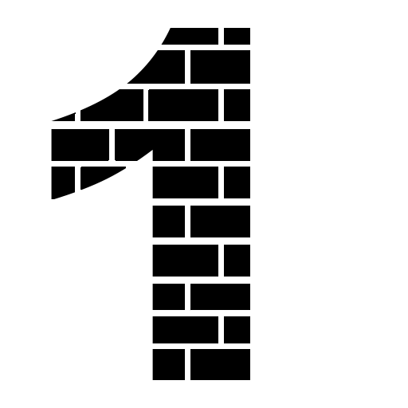
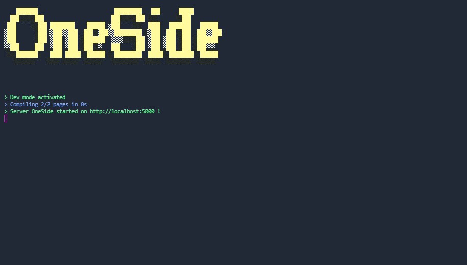

<div align="center" style="margin-bottom: 20px">
    <a href="https://www.npmjs.com/package/oneside">
        
    </a>
    <h1>OneSide</h1>
    <br>
    
    
    
    
</div>

<br>

OneSide is a web server that allows you to create a website with NodeJs. With OneSide, you create the backend and the frontend of your application in a single project. OneSide uses EJS for pre-rendered pages and Express for the Http server.

## Features

- 📨 Fast thanks to pre-compiled and cached pages
- ⚙️ Pre-rendered page with EJS
- 👍 Easy to use (Same structure as an Express project)
- 🔁 Live server
- ✨ Coded in TypeScript

# Quick start

Start by installing OneSide Cli on your computer. This package allows you to create a OneSide project easily and to create your website with the live server. This allows you to automatically refresh and restart your server when you modify it.

```bash
$ npm i --global oneside-cli
```

Now create a new project. To start, open the folder where you want to create your project with your cmd (a new folder will be created in it). Then enter the following command to create your project.

```bash
$ oneside init my-project
```

Then enter in your project folder and start the server using OneSide cli.

```bash
$ cd my-project
$ oneside start
```

And that's it! You are ready to code!



# Usage

Example of a basic OneSide server.

```js
const oneside = require('oneside');
const app = oneside.init({
  port: 5050,
});

oneside.get('/', (req, res) => {
  oneside
    .render('home', res)
    .ejs({
      message: 'Hello world !',
    })
    .send();
});

app.listen();
```
